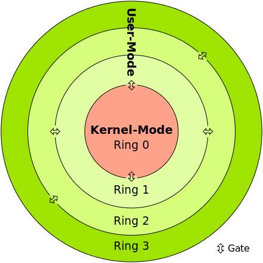
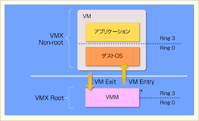

## KVMについて
勉強会資料  

by GitPitch
---

Kernel-based Virtual Machine  

2006年にQumranetが開発  
2008年にRedHatに買収  

+++

CPUの仮想化支援機能を前提に設計  

AWSのEC2インスタンスとしても採用  
➔C5、M5  

---

### CPUの動作モード  
リングプロテクション  

+++
Ring0：カーネルモード  
Ring3：ユーザーモード  

- Ring0は特権命令を出せる |
- Ring3は特権命令を直接出せない |

+++

仮想環境だとこれだけでは足りない  
ゲストOSの「センシティブ命令を」検知して処理する必要がある  

+++

### センシティブ命令とは？

#### 特権命令 |
- ユーザーモードで実行するとトラップされる命令 |
    
#### センシティブ命令 |
- システム資源の構成を変えたり依存している命令 |

- センシティブ命令を特権命令のようにトラップさせる |

+++
### 主な実装方式
- 完全仮想化
- 準仮想化

+++

### 完全仮想化  
- ゲストOSに変更は加えない |
- センシティブ命令はバイナリトランスレーションという命令にVMMが変換して処理 |
- バイナリトランスレーションは処理重め |

+++

### 準仮想化  
- ゲストOSをカスタマイズ |
- センシティブ命令をハイパーバイザコールという命令で直接VMMへ渡す |
- オーバヘッド少ないけどカスタマイズされたOSが必要 |

+++

### CPUの仮想化支援機能
センシティブ命令をVMMやゲストOSでなくCPUで解決するアプローチ  
- Intel VT-x
- AMD-v
  
- リングプロテクションモデルはそのまま |
- ホストの処理とゲストの処理を分離させる |

+++

#### ホスト(VMM)のモード：VMX rootモード  
#### ゲストマシンのモード：VMX non-rootモード  
※Intel VT-xの場合  

- センシティブ命令をゲストで実行させる |
- 実行を検知したらrootモードに遷移して実行される |

+++

+++

バイナリトランスレーションのようなオーバヘッドがなく、OS改変も不要

+++

non-rootモードへの遷移はVM-Entry  
rootモードへの遷移はVM-Exit  

+++

VM-Entry/Exit自体もオーバヘッドになるので極力回数を減らす方が良い

---

### QEMU
QEMUはハードウェアのエミュレータ  
KVMよりも大分前から仮想化ソフトとして使われている  

+++
従来のQEMUではセンシティブ命令を判定する処理が発生  
  
KVMはCPUでセンシティブ命令をフックするため判定が不要で高速化している

+++

CPUの仮想化については前述のCPU仮想化技術を利用しそれ以外の部分でQEMUを使っている  
(メモリやディスクI/Oの仮想化など)  

VMの管理機能としてlibvirtを採用している。

+++
